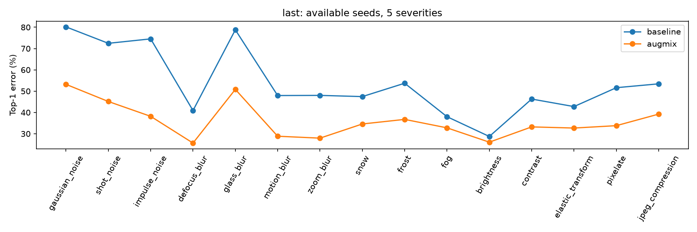

# AugMix 復現｜CIFAR-100／WRN-40-2

## 論文資訊

- **Paper**：AugMix: A Simple Data Processing Method to Improve Robustness and Uncertainty
- **Authors**：Dan Hendrycks、Norman Mu、Ekin D. Cubuk、Barret Zoph、Justin Gilmer、Balaji Lakshminarayanan
- **Venue / Year**：ICLR 2020
- **Paper URL**：[論文 v2](https://arxiv.org/abs/1912.02781v2)／[全文](https://arxiv.org/pdf/1912.02781v2)
- **Official Code**：[google-research/augmix](https://github.com/google-research/augmix)

## 論文摘要

原論文關注影像分類器在訓練與測試分布不一致時的可靠性。模型在乾淨資料上準確，遇到未見過的影像干擾仍可能失準，且信心估計不可靠。AugMix 透過隨機增強鏈的混合與預測一致性損失，提高常見干擾下的穩健性，並評估不確定性與校準表現。來源：[原論文摘要](https://arxiv.org/abs/1912.02781v2)。

## 研究目的

核心研究問題是：**在不依賴測試干擾來訓練的情況下，能否用簡單的資料處理提升對未知干擾的穩健性，同時維持乾淨影像的分類能力與較可靠的信心估計？** 動機是現有增強方法可能缺乏多樣性，或因過度串接操作而破壞影像語意。來源：[原論文第 1–3 節](https://arxiv.org/pdf/1912.02781v2)。

## 研究方法

AugMix 隨機建立多條影像增強鏈，使用 Dirichlet 權重混合各鏈輸出，再以 Beta 權重與原圖混合。完整方法保留原圖的分類交叉熵，並以 Jensen–Shannon divergence（JSD）約束原圖與兩個獨立 AugMix 版本的預測一致。論文刻意排除與評估干擾重疊的部分操作，避免直接用測試干擾訓練。來源：[原論文第 3 節與演算法](https://arxiv.org/pdf/1912.02781v2#page=3)。

## 原論文主要成果

與本專案直接相關的是 [Table 1 的 CIFAR-100-C／WideResNet（WRN-40-2）列](https://arxiv.org/pdf/1912.02781v2#page=6)：Standard 平均分類錯誤率 **53.3%**，完整 AugMix **35.9%**。論文在多個架構與干擾資料集呈現穩健性改善，並另評估校準與預測穩定性；這些較廣的結論須由相應實驗支持，不能只從本專案的 corruption error 推論。

## 本專案復現範圍

本專案只復現 CIFAR-100、作者 WRN-40-2 的 Baseline 與包含 JSD 的完整 AugMix，各使用 seeds 0、1、2、每次 100 輪，共六次正式訓練。評估 clean CIFAR-100，以及 CIFAR-100-C 的 15 種干擾 × 5 個強度；主表固定採最後一輪 `last`，另保留 `best`。未復現其他架構、CIFAR-10、ImageNet、擾動序列穩定性、校準指標或關閉 JSD 的消融。

## 本專案復現結果

下表使用每次訓練最後一輪的模型，列出三次平均 ± 樣本標準差。**錯誤率越低越好**；「±」描述三次實驗的波動，不是誤差上限。

|測試項目|一般訓練 Baseline|完整 AugMix|平均改善|
|---|---:|---:|---:|
|原始圖片 Top-1 錯誤率|24.707 ± 0.264%|23.330 ± 0.226%|1.377 百分點|
|原始圖片 Top-5 錯誤率|6.753 ± 0.220%|5.530 ± 0.095%|1.223 百分點|
|受干擾圖片平均 Top-1 錯誤率|53.655 ± 0.462%|35.922 ± 0.098%|17.733 百分點|
|受干擾圖片平均 Top-5 錯誤率|30.470 ± 0.520%|13.519 ± 0.060%|16.951 百分點|

Top-1 是模型最有把握的答案；Top-5 是前五個答案是否包含正解。百分點是兩個百分比直接相減，例如 53.655% − 35.922% = 17.733 百分點，不是相對改善 17.733%。



藍線是一般訓練，橘線是 AugMix。AugMix 在這次 15 種干擾的平均錯誤率都較低。三次實驗平均後，75 個「干擾種類 × 強度」組合也都改善；這不代表它們是 75 個彼此獨立的實驗。

### 與原論文的數值對照

只比較論文 Table 1 中同樣的 **CIFAR-100-C／WRN-40-2**：

|方法|論文|本次平均|本次減論文|
|---|---:|---:|---:|
|Baseline|53.3%|53.655%|+0.355 百分點|
|完整 AugMix|35.9%|35.922%|+0.022 百分點|

## 結果討論與限制

**趨勢重現**：本次選定架構的干擾錯誤率改善方向與原論文一致。**數值接近**：以下沿用原 README 的差距分析；此接近程度不等於統計等價或完整復現。

**差距小，但數字接近本身不是程式正確的證明。** 論文的 AugMix 只報到小數一位；本次 35.922% 用同樣位數表示也是 35.9%。Baseline 的三次結果則為 53.473%、53.311%、54.181%，可見換種子會有波動；但這不能證明論文差距全部由種子造成。

已確認的差異包括套件版本、部分 GPU 計算選項、隨機數分配方式。它們可能影響結果，但**沒有逐項對照實驗，不能把 0.355 百分點拆成每個因素各占多少**。詳見 [數值差距分析](docs/PAPER_DIFFERENCES.md) 與 [完整結果報告](reproduction_report.md)。

每輪會看原始 test set，並用它選 `best`，所以 test set 不是完全未參與選模的獨立測試。三個種子不足以證明所有情況都改善。未做 ImageNet、校準指標或關閉 JSD 的額外實驗。

## 實驗與復現細節

### 本專案實驗流程與既有核查

1. **核對來源。** 閱讀論文 v2 與附錄，固定官方程式版本，確認此架構訓練 100 輪，不挪用其他模型的 200 輪設定。
2. **建立獨立環境。** 使用 Python 3.12.14、PyTorch 2.11.0+cu128；沒有修改其他研究環境，也沒有刻意降級到作者當年的 PyTorch 1.2。
3. **下載並檢查資料。** CIFAR-100 來自官方網站；CIFAR-100-C 來自官方程式指定的 Zenodo。檢查檔案雜湊、圖片形狀、每個強度的 10,000 張圖片與標籤。
4. **先做小型測試。** 9 項測試通過，包含模型、增強、JSD、指標、AMP 開關與兩方法的中斷恢復。小型對照中，恢復後資料順序、loss、權重完全相同；不把這擴大宣稱成任何硬體都能一致。
5. **測顯存、測速度。** 實際做 forward、反向傳播與更新；AugMix 一次放入原圖加兩張增強圖。再各跑五個完整輪次估時。
6. **正式跑六次。** 順序是 seed 0 的 Baseline／AugMix，再 seed 1、seed 2；每次重新初始化，不沿用測速模型。
7. **測試兩種模型存檔。** `last` 是第 100 輪；`best` 是原始 test Top-1 最好的一輪。主比較固定使用 last，另列 best，沒有看完結果再換規則。
8. **修正評估設定並重測。** 核查發現獨立評估漏設 GPU 計算選項，因此把全部 12 個模型重評。舊結果保留，正式表只用設定一致的版本。
9. **核對交付。** 600 輪連續紀錄、12 個模型雜湊、912 列評估全部核查。原始 test 指標也都能重現保存模型時的紀錄。

### 本專案關鍵設定

|項目|本次設定|
|---|---|
|資料／模型|CIFAR-100／作者的 WRN-40-2，2,255,156 個參數|
|每次訓練|100 輪；每批 128 張原始樣本|
|基本圖片處理|隨機左右翻轉、裁切；各色彩通道 mean/std 都是 0.5|
|更新方法|SGD；初始學習率 0.1；momentum 0.9；weight decay 0.0005；Nesterov 開啟|
|學習率|每次更新後按 cosine 曲線下降，最後為 0.000001|
|AugMix|9 種官方操作；3 條鏈；每條隨機做 1–3 次操作；severity 3；混合參數 α=1|
|完整損失|原圖分類損失 + 12 × JSD；JSD 要求同一張圖的三個版本給出接近的預測|
|三張圖如何計算|串接成一次 forward，共 384 張；沒有拆成三次或梯度累積|
|未加入的技巧|CutMix、Mixup、AutoAugment、label smoothing、EMA、預訓練|

逐項對照見 [SOURCE_AUDIT.md](SOURCE_AUDIT.md)。作者的 `--no-jsd` 仍會做 AugMix，不能當成這裡的 Baseline。

### 中斷與負面紀錄

有，沒有隱藏：

- 正式訓練前，小型測試發現 JSON 寫入問題；修正後通過測試。
- Baseline seed 1 在第 68 輪後停滯，監控器一小時後終止程序；原因尚未查明。確認存檔完整後，用原設定從第 69 輪恢復並完成。
- 輔助監控寫狀態檔時遇 Windows 存取錯誤，已加重試，沒有改訓練參數。
- 第一版評估的 cuDNN／TF32 設定與訓練不同，少數 clean 指標相差最多 0.03 百分點。已完整重評，兩版紀錄都保留。
- 早期有些 test error 短暫上升，隨後恢復；沒有 NaN／Inf，但尖峰的真正原因仍未證實。

沒有因為中斷而丟棄 seed 1，也沒有挑選較好的重訓結果。詳見報告第 7 節與 [事件紀錄](experiment_records/baseline_seed1/events.jsonl)。

## 環境

已使用的套件版本為 Python 3.12.14、PyTorch 2.11.0+cu128；其餘版本保留於 [requirements-lock.txt](requirements-lock.txt)。

正式訓練紀錄合計約 **9.00 小時**，含正常驗證與主要存檔開銷；從最初檢查到最終重評完成約 **17.88 小時**，含下載、暫停、停滯和重評。硬體為單張 RTX 3070 Ti 8GB；正式訓練用 FP32，不用 AMP。AugMix peak reserved 顯存約 **2.846 GiB**，低於上限 7.1996 GiB。

## 如何重跑

### 核對已發表紀錄

安裝 Python 3.12 後，在專案目錄執行：

```powershell
python tools/audit_published_results.py
```

只用 Python 標準函式庫，重新計算 CSV 的平均、標準差和改善量，核對 600 輪與 912 列評估。它能核對紀錄一致性，**不能取代載入權重重新推論**。

### Windows／NVIDIA GPU 重跑

這是本次實際環境路線；沒有宣稱已測過 Linux 或其他 GPU。新電腦需安裝相容 NVIDIA 驅動，並準備足夠硬碟空間存放資料、環境與權重。

```powershell
py -3.12 -m venv .venv
.\.venv\Scripts\python.exe -m pip install --upgrade pip
.\.venv\Scripts\python.exe -m pip install torch==2.11.0+cu128 torchvision==0.26.0+cu128 --index-url https://download.pytorch.org/whl/cu128
.\.venv\Scripts\python.exe -m pip install -r requirements-lock.txt --extra-index-url https://download.pytorch.org/whl/cu128
.\.venv\Scripts\python.exe -X utf8 prepare.py
.\.venv\Scripts\python.exe -X utf8 -m pytest test_core.py -q
.\.venv\Scripts\python.exe -X utf8 preflight.py
.\.venv\Scripts\python.exe -X utf8 reproduce.py train --config configs/smoke.json --run runs/smoke
```

再依序訓練、評估：

```powershell
foreach ($seed in 0,1,2) {
  foreach ($method in 'baseline','augmix') {
    .\.venv\Scripts\python.exe -X utf8 reproduce.py train --config "configs/${method}_seed${seed}.json" --run "runs/${method}_seed${seed}"
    if ($LASTEXITCODE -ne 0) { throw '訓練失敗，請保留紀錄並檢查' }
  }
}
foreach ($seed in 0,1,2) {
  foreach ($method in 'baseline','augmix') {
    .\.venv\Scripts\python.exe -X utf8 reproduce.py evaluate --run "runs/${method}_seed${seed}"
    if ($LASTEXITCODE -ne 0) { throw '評估失敗，請檢查' }
  }
}
```

相同訓練命令會從 `last.pt` 恢復，設定必須相同。若改實驗條件，請用新 run 目錄。`reproduce.py` 是發布用入口，只呼叫原訓練核心並明確設定評估後端，沒有改掉本次六個實驗。

`pipeline.py` 和 `validation/evaluate_aligned.py` 保留原實驗的控制／修正流程，包含當時的期限或檔案布局，**不是新電腦的一鍵入口**。`run.py eval` 是保留的舊入口，不應用來產生正式比較數字；新實驗請用 `reproduce.py`。

## Repository 結構

|檔案／資料夾|內容|
|---|---|
|[完整結果報告](reproduction_report.md)|每個 seed、best／last、干擾明細、時間、問題與限制|
|[數值差距分析](docs/PAPER_DIFFERENCES.md)|哪些差異已知，哪些解釋只是可能|
|`core.py`、`vendor/augmix/`|實際訓練核心、原作者模型與增強程式，保留原授權|
|`configs/`、`test_core.py`|正式設定、小型測試設定及測試|
|`experiment_records/<方法>_seed<seed>/`|逐輪 CSV、評估、事件、摘要與模型雜湊；不是權重|
|`experiment_records/logs/`|測試與異常紀錄，已遮蔽本機私人路徑|
|`results/`|表格、統計、圖與原始完整性核查結果|
|`results/formal_source/`|正式訓練時凍結的程式版本|
|`checkpoint_manifest.json`|留在本機的 12 份權重之大小與 SHA-256|

**上傳範圍：**程式、設定、授權、結果與可核查的小型紀錄；不把資料集、`.venv`、模型權重放進一般 Git。權重仍在原實驗電腦，沒有上傳。clone 後可以核對數字或重新訓練，但不能直接載入未附的本次權重做推論。論文 PDF 也不另行散布，請使用作者連結。

## 參考資料

- [論文 v2](https://arxiv.org/abs/1912.02781v2)
- [官方程式](https://github.com/google-research/augmix)，commit `9b9824c7c19bf7e72df2d085d97b99b3bfb00ba4`
- [CIFAR 資料來源](https://cave.cs.toronto.edu/kriz/cifar.html)
- [CIFAR-100-C](https://zenodo.org/records/3555552)

本專案是獨立復現，不是作者官方版本。詳見 [NOTICE.md](NOTICE.md)；Apache-2.0 與第三方 MIT 原文均已保留。
