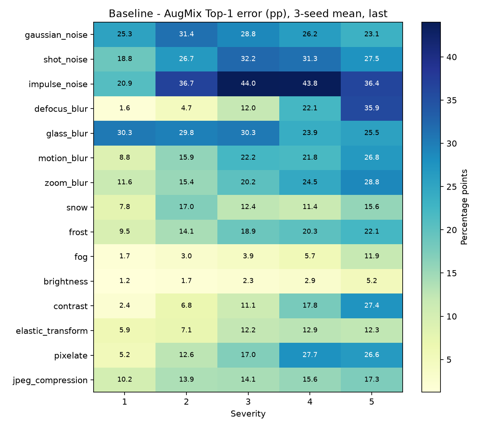
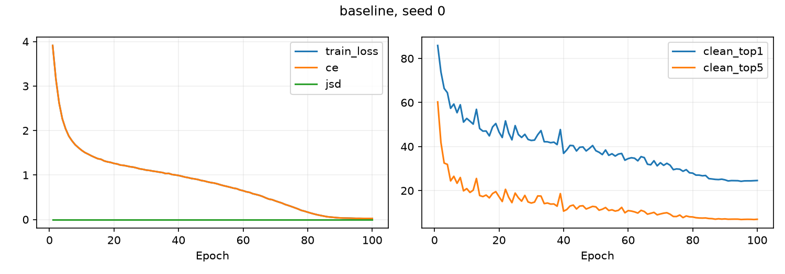
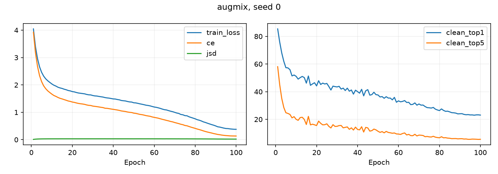

# AugMix：CIFAR-100／WRN-40-2 復現報告

六次正式訓練與一致設定的完整評估已完成：Baseline／AugMix，各 seeds 0、1、2，各100 epochs。共600輪、12個best/last checkpoint、912列clean或corruption/severity評估。沒有ImageNet訓練，也沒有另加Mixup、CutMix、EMA或預訓練。

主要結果（last）：CIFAR-100-C 平均Top-1錯誤率由 **53.655% 降至 35.922%**，改善 **17.733百分點**。三個seed皆改善，但不能因此宣稱統計等同或超越論文。

閱讀方式：epoch 是把訓練資料走完一輪；seed 是控制隨機抽樣的起始值；checkpoint 是模型存檔；clean 是原始測試圖片；corruption 是受干擾圖片。Top-1 錯誤率看最有把握的答案是否答錯，Top-5 看前五個答案是否都沒有正解。所有錯誤率越低越好，改善「百分點」是兩個百分比直接相減。實際操作順序與重做命令見 [README](README.md)。

## 1. 已核對的來源、設定與公平比較

論文為arXiv:1912.02781v2（2020-02-17，ICLR 2020），已閱讀主文與附錄並目視核對Table 1。官方commit為`9b9824c7c19bf7e72df2d085d97b99b3bfb00ba4`。Google程式為Apache-2.0；第三方WRN為MIT，原始授權與來源保留於vendor/augmix。完整論文／官方／本次對照見 [SOURCE_AUDIT.md](SOURCE_AUDIT.md)。

WRN-40-2原始模型與初始化直接匯入，參數2,255,156；batch=128、100 epochs、SGD lr=.1、Nesterov momentum=.9、weight decay=.0005，每step後cosine排程至1e-6。基本處理為左右翻轉、padding4隨機裁切、各channel mean/std=.5。AugMix採官方九操作、severity3、width3、depth均勻1–3、Dirichlet/Beta α=1。

AugMix將基本增強後原圖與兩個獨立AugMix視圖串接，一次forward，CE只計原圖；loss=CE+12×JSD，mixture clamp[1e-7,1]後log，所有分支保留梯度。Baseline無AugMix與JSD；兩者其餘訓練條件相同，沒有梯度累積或拆分forward。

主比較固定使用last；best依每輪clean test Top-1嚴格改善選取（同分保留先前）。test因此參與選模，不能宣稱完全獨立未使用。資料未參與梯度更新，也未根據測試數字調參、換seed或挑較佳run。

## 2. 主要結果：三次平均與樣本標準差

數字皆為錯誤率百分比；標準差使用ddof=1，n=3。

|方法|checkpoint|clean Top-1|clean Top-5|CIFAR-C Top-1|CIFAR-C Top-5|
|---|---|---|---|---|---|
|baseline|last|24.707 ± 0.264|6.753 ± 0.220|53.655 ± 0.462|30.470 ± 0.520|
|augmix|last|23.330 ± 0.226|5.530 ± 0.095|35.922 ± 0.098|13.519 ± 0.060|
|baseline|best|24.433 ± 0.396|6.683 ± 0.179|53.919 ± 0.166|30.763 ± 0.169|
|augmix|best|23.253 ± 0.211|5.543 ± 0.131|36.099 ± 0.106|13.704 ± 0.200|

## 3. 每個seed與checkpoint

同列Top-1／Top-5來自同一checkpoint，沒有分別選指標最佳值。

|方法|seed|checkpoint|epoch|clean Top-1|clean Top-5|CIFAR-C Top-1|CIFAR-C Top-5|
|---|---|---|---|---|---|---|---|
|baseline|0|best|95|24.2200|6.8800|53.8412|30.7949|
|baseline|0|last|100|24.5800|6.9800|53.4735|30.3993|
|augmix|0|best|97|23.0100|5.6800|36.0567|13.7389|
|augmix|0|last|100|23.0900|5.5800|35.8267|13.4808|
|baseline|1|best|98|24.8900|6.6400|53.8064|30.5808|
|baseline|1|last|100|25.0100|6.7400|53.3112|29.9899|
|augmix|1|best|99|23.3900|5.5300|36.2197|13.8844|
|augmix|1|last|100|23.5400|5.5900|35.9164|13.5887|
|baseline|2|best|96|24.1900|6.5300|54.1093|30.9141|
|baseline|2|last|100|24.5300|6.5400|54.1805|31.0220|
|augmix|2|best|100|23.3600|5.4200|36.0219|13.4889|
|augmix|2|last|100|23.3600|5.4200|36.0219|13.4889|

成對改善定義為Baseline−AugMix，正值代表AugMix錯誤率較低。

|checkpoint|seed|clean Top-1改善|clean Top-5改善|CIFAR-C Top-1改善|CIFAR-C Top-5改善|
|---|---|---|---|---|---|
|last|0|1.4900|1.4000|17.6468|16.9185|
|last|1|1.4700|1.1500|17.3948|16.4012|
|last|2|1.1700|1.1200|18.1587|17.5331|
|best|0|1.2100|1.2000|17.7845|17.0560|
|best|1|1.5000|1.1100|17.5867|16.6964|
|best|2|0.8300|1.1100|18.0875|17.4252|

## 4. Corruption定義與明細

E[c,s]=100×錯誤樣本數/10000；平均錯誤率=(1/15)Σc(1/5)Σs E[c,s]。不是ImageNet-C以AlexNet正規化的mCE。各severity使用[10000(s−1):10000s]，五段標籤已逐項確認等於原始test labels。

[corruption_detail.csv](results/corruption_detail.csv)包含全部900列corruption明細（六run×兩checkpoint×75）；各 experiment_records/<run>/evaluation.csv另含clean，共912列。官方15類如下，其餘archive額外類型未納入平均。

|corruption（last，三seed與五severity平均）|Baseline|AugMix|改善百分點|
|---|---|---|---|
|gaussian_noise|80.175|53.195|26.980|
|shot_noise|72.459|45.145|27.315|
|impulse_noise|74.545|38.180|36.365|
|defocus_blur|40.895|25.631|15.264|
|glass_blur|78.792|50.830|27.962|
|motion_blur|47.938|28.837|19.101|
|zoom_blur|48.011|27.936|20.075|
|snow|47.446|34.590|12.856|
|frost|53.717|36.742|16.975|
|fog|38.014|32.775|5.239|
|brightness|28.721|26.051|2.669|
|contrast|46.295|33.218|13.077|
|elastic_transform|42.757|32.677|10.080|
|pixelate|51.625|33.798|17.827|
|jpeg_compression|53.435|39.219|14.217|

三seed平均下，75個corruption/severity cell 中有75個改善。這是描述統計，不是75個獨立實驗。

## 5. 與論文差距的完整說明

**差距小，沒有發現足以推翻主要結果的實作錯誤；但沒有證據能把每一點差距分配給某個原因。** 以下分開說明已量到的差別、已知設定差異和未證實的解釋。

### 1. 先確認比較同一件事

對照論文 v2 第 6 頁 Table 1，CIFAR-100-C 的 WideResNet；正文說明該模型是 WRN-40-2。本次也是這個模型、同一個資料集、同一份 15 種干擾清單和 5 個強度。

|項目|論文|本次三次平均（last）|本次減論文|
|---|---:|---:|---:|
|Baseline 錯誤率|53.3%|53.6551%|+0.3551 百分點|
|完整 AugMix 錯誤率|35.9%|35.9216%|+0.0216 百分點|
|AugMix 改善量|17.4 百分點|17.7334 百分點|+0.3334 百分點|

沒有比較 CIFAR-10、ImageNet、其他架構，也沒有使用 ImageNet-C 經 AlexNet 正規化的 mCE。論文沒找到相同架構的 CIFAR-100 clean Top-1／Top-5 完整表格，所以那部分只報本次數字。

### 2. 論文只顯示一位小數

論文的 35.9% 不是公開到足以比較小數點後四位的原始值。本次 35.9216% 若也只顯示一位小數，就是 **35.9%**。不能把 +0.0216 百分點說成已證實比論文差了一個可辨別的量。

Baseline 不能只靠四捨五入解釋：本次約 53.7%，論文 53.3%，仍有約 0.36 百分點差距。要再看不同訓練的波動與設定差異。

### 3. 本次確實觀察到種子的波動

|seed|Baseline CIFAR-100-C|AugMix CIFAR-100-C|
|---|---:|---:|
|0|53.4735%|35.8267%|
|1|53.3112%|35.9164%|
|2|54.1805%|36.0219%|
|平均 ± 樣本標準差|53.6551 ± 0.4622%|35.9216 ± 0.0977%|

即使設定固定，只換隨機種子，初始化、資料順序與增強抽樣也會不同。這次 Baseline 最大與最小相差約 0.87 百分點；與論文差 0.36 百分點，在這個尺度上不突出。

**這不是因果證明。** 沒有作者同條件的每次原始結果，不能說「一定只是 seed」，也不能因差距小於本次標準差就宣稱統計相同。三次只提供有限的波動觀察。

### 4. 已確認的設定差異，可能如何影響數字？

|已確認的事實|白話解釋|是否能量出造成多少論文差距？|
|---|---|---|
|本次用 PyTorch 2.11.0、torchvision 0.26.0、較新 Pillow；作者需求檔列 PyTorch 1.2 等舊版本|相同操作在不同版本裡，底層計算或圖片處理可能不同|不能，沒有舊環境逐項對照|
|官方開 cudnn.benchmark；本次關閉，使用較固定的 cuDNN 計算方式並關閉 TF32|GPU 計算路徑不同，浮點數小差異可能在訓練累積|不能，沒有只改此項的完整訓練對照|
|本次依 seed／epoch／樣本 index 分配隨機數|翻轉、裁切、AugMix 規則不變，但抽到的順序不同，方便恢復|不能，只能確認不是作者原始隨機序列|
|本次保存完整 resume 狀態|中斷後能接續，不重新開始排程或遺失先前最佳值|不是新訓練技巧；小型一致性測試通過，不等於完整不中斷對照|
|修正官方 test loss 加權|本次把所有樣本的 loss 加總再除以樣本數|只影響 test loss 報表，不改梯度，不能解釋 Top-1 差距|

本次沒有縮短訓練、換小模型、減少 batch、用梯度累積、關閉 JSD、額外增強、挑 seed 或預訓練。兩方法共用同一現代環境，因此主要比較保持公平。

### 5. 選哪個模型存檔也有差

主比較在正式訓練前固定使用第 100 輪 `last`；另報依原始 test Top-1 選出的 `best`。

|存檔|Baseline CIFAR-100-C 平均|AugMix CIFAR-100-C 平均|
|---|---:|---:|
|last|53.6551%|35.9216%|
|best|53.9190%|36.0994%|

`best` 是原始圖片測試較好的那輪，**不是受干擾圖片一定最好**。這裡 best 的 corruption 平均反而比 last 高。必須明講規則，不能看完數字再挑更好看的那列。

官方 CIFAR 程式結尾用最後一輪做 corruption 評估，因此本次主比較用 last；論文未完整描述所有選模細節。無法證明這就是論文差距的原因。

### 6. 確實發現並修正過一個評估問題

第一版獨立評估忘記套用訓練的 cuDNN／TF32 設定，讓部分 clean 指標與 epoch 紀錄相差 0.01–0.03 百分點。這有實測證據：同一份 Baseline seed 0 last 權重，統一設定後 Top-1 回到 24.58%，Top-5 與 loss 也一致。

我們保留第一版紀錄，用一致設定把 **12 個 checkpoint 全部重評**。最終 12 組 clean Top-1／Top-5 都與原 epoch 紀錄一致；沒有動權重、重訓或混用兩版數字。

|CIFAR-100-C 平均|第一版|修正後正式結果|改變量|
|---|---:|---:|---:|
|Baseline last|53.654044%|53.655067%|+0.001022 百分點|
|AugMix last|35.921200%|35.921644%|+0.000444 百分點|

所以這個問題值得修正，但實際影響很小，**無法解釋全部 +0.3551 百分點的 Baseline 差距**。詳細比較見 [evaluation_backend_comparison.csv](results/evaluation_backend_comparison.csv)；完整舊表在各 `experiment_records/<run>/evaluation_initial_default_backend/`。

### 7. 停滯或誤差尖峰是否讓結果失效？

Baseline seed 1 在第 68 輪後停止前進。終止後確認 checkpoint、CSV、optimizer、scheduler、隨機狀態完整，使用相同程式和設定恢復至第 100 輪。根因仍未確認；未找到對應休眠事件，也沒有當時存活程序的完整堆疊可追查。

小型「不中斷 vs 中斷恢復」測試通過，但沒有另跑完整不中斷 seed 1 作一對一對照。因此不能保證停滯對正式模型毫無數值影響；也不能沒證據就把論文差距歸咎於它。

早期 clean error 曾短暫上升，例如 Baseline seed 0 第 22 輪由 44.11% 升到 51.65%，下一輪降到 46.16%。訓練 loss 繼續下降，沒有 NaN／Inf，後期穩定。學習率或 BatchNorm 狀態都可能相關，但未做專門診斷，所以保留現象，不武斷稱為完全正常。

### 8. 可以下什麼結論？

**可以說：**在這次單張 3070 Ti、CIFAR-100、WRN-40-2、三個指定 seed 的範圍，完整 AugMix 降低受干擾圖片的平均錯誤率，方向及幅度接近論文。程式、資料、紀錄與評估有實際核查依據。

**不能說：**已找到差距唯一原因、算出每個設定各造成多少差距、三次已證明與論文統計相同，或數字接近所以程式不可能有問題。

要追查原因，需要一次只改一個條件的對照，例如固定種子／資料順序比較後端，或另做完整不中斷 seed 1。這些本次沒有偷偷加入，也沒有用來調參追求論文數字。就目前小幅差距與核查結果，沒有證據要求把六次主要實驗全部推翻重做。

## 6. 實際時間、顯存與環境

|方法|seed|訓練h|每輪驗證合計h|epoch含checkpoint合計h|peak allocated GiB|peak reserved GiB|
|---|---|---|---|---|---|---|
|baseline|0|0.996|0.065|1.071|0.728|1.812|
|augmix|0|1.845|0.065|1.920|2.183|2.846|
|baseline|1|1.001|0.065|1.076|0.728|1.812|
|augmix|1|1.856|0.065|1.931|2.183|2.846|
|baseline|2|0.999|0.065|1.074|0.728|1.812|
|augmix|2|1.852|0.065|1.928|2.183|2.846|

正式600輪紀錄合計 **8.999小時**（含正常驗證與checkpoint主要開銷）；一致設定重評純評估 **0.611小時**。從初始環境檢查到重評完成約 **17.88小時**，包含下載、使用者暫停、停滯、恢復與第一版評估，低於168小時。epoch計時不包含停滯等待與epoch中斷未提交的工作，也略去CSV與第二次checkpoint寫入尾端開銷；不得將epoch合計當全部wall time。

硬體為RTX3070Ti 8GB、i7-11700K（8核16執行緒）、約32GB RAM、Windows11；driver591.86、Python3.12.14、PyTorch2.11.0+cu128、torchvision0.26.0+cu128、NumPy2.5.2、CUDA runtime12.8、cuDNN91900。driver顯示CUDA13.1為驅動支援上限，並非本次PyTorch runtime。詳見environment.json與requirements-lock.txt。

顯存上限7.19956GiB。正式FP32保留官方batch128，AugMix每forward串接384張；preflight另測AMP開關但正式不用AMP。兩方法實測peak均低於上限。

## 7. 測試、異常與可重現性

9項測試實際通過，涵蓋模型、混合/獨立增強、JSD公式及梯度、Top-1/Top-5與不完整batch加權、corruption切片、AMP兩路徑，以及兩方法真實小資料的checkpoint/resume。不中斷對恢復的smoke在目前環境具有相同後續資料順序、loss、權重（最大權重差0）。未啟用全域deterministic_algorithms；這不是任何硬體或任意batch邊界的精確恢復保證。

保存model、optimizer、scheduler、GradScaler、epoch、best狀態、設定、RNG與完整CSV rows；中斷時由最後完整epoch恢復，該epoch之後未提交工作重新執行。

- 首次smoke的NumPy bool JSON序列化失敗已在正式訓練前修正，原始失敗日誌保留。
- Baseline seed1在epoch68後停滯，一小時無進度觸發終止。原因未確認，沒有找到對應休眠證據。checkpoint/CSV/scheduler驗證完整，以相同程式及設定恢復epoch69–100，沒有挑結果或另換seed。
- 早中期clean error曾短暫上升，例如Baseline seed0 epoch22增加7.54百分點；訓練loss持續下降且隨後恢復，沒有NaN/Inf。BatchNorm或學習率只屬可能原因，未完成專門因果診斷，不把尖峰直接當成已證明正常。
- 健康監控替換狀態JSON曾遇Windows存取錯誤，已僅修正監控重試，不改訓練。
- 首版獨立評估遺漏訓練的cuDNN/TF32設定，clean最多差0.03百分點。所有第一版明細保留，已在一致後端下完整重評12個checkpoint；最終12組clean Top-1/Top-5均與原epoch紀錄完全一致。本報告只使用一致後端結果，不混合兩版。差異表見results/evaluation_backend_comparison.csv。

## 8. 交付與未完成項目

主要範圍全部完成；未做calibration或無JSD消融，這些是選做項目。停滯根因及早期誤差尖峰機制尚未查明；沒有額外完整不中斷seed1對照。原始權重留在實驗電腦各 runs 目錄。公開 GitHub 包含程式與實驗紀錄，不包含資料集、虛擬環境或權重；checkpoint_manifest.json 提供權重大小與 SHA-256。

新電腦重做請依 README 使用 reproduce.py；歷史控制腳本包含原實驗的期限與檔案布局。公開紀錄核查使用 tools/audit_published_results.py，僅確認 CSV／JSON 一致性，不等於重新載入權重推論。

程式凍結版本在results/formal_source；一致後端重評入口為validation/evaluate_aligned.py；本報告核查／生成入口為validation/finalize.py。不要用原run.py eval重新產生未對齊後端的正式表格。

其餘四個run曲線在results/*_curves.png。詳細來源：https://arxiv.org/abs/1912.02781v2 、https://github.com/google-research/augmix 、https://zenodo.org/records/3555552 。
